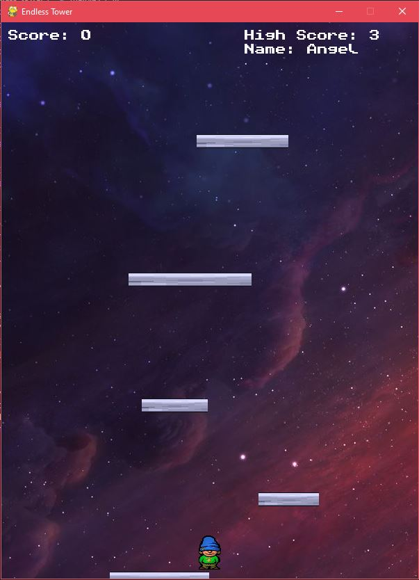

# endless_tower

Versión actual: `v1.1.0`

Torre infinita inspirada en Icy Tower. Subi, esquiva meteoros y superá tu puntaje.

## Cómo jugar

1. Creá y activá un entorno virtual.
2. Instalá dependencias con `pip install -r requirements.txt`.
3. Ejecutá el juego con `python main.py`.
4. Usa `Izquierda`, `Derecha` y `Espacio` para jugar.

## Características principales
- Puntaje persistente con SQLite.
- Animaciones del jugador.
- Meteoros y plataformas dinámicas.
- Pantalla de game over.

## Tecnologías utilizadas

- Python
- Pygame
- SQLite
